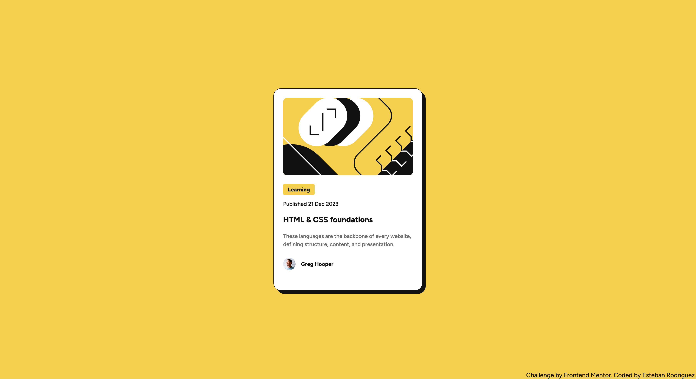

# Frontend Mentor - Blog preview card solution

This is a solution to the [Blog preview card challenge on Frontend Mentor](https://www.frontendmentor.io/challenges/blog-preview-card-ckPaj01IcS). Frontend Mentor challenges help you improve your coding skills by building realistic projects.

## Table of contents

- [Overview](#overview)
  - [The challenge](#the-challenge)
  - [Screenshot](#screenshot)
  - [Links](#links)
- [My process](#my-process)
  - [Built with](#built-with)
  - [What I learned](#what-i-learned)
  - [Continued development](#continued-development)
  - [Useful resources](#useful-resources)
  - [AI Collaboration](#ai-collaboration)
- [Author](#author)
- [Acknowledgments](#acknowledgments)

## Overview

### The challenge

Users should be able to:

- See hover and focus states for all interactive elements on the page

### Screenshot



### Links

- Live Site URL: [Live Site](https://estebanrodriguez28.github.io/blog-preview-card/)

## My process

- Began with creating the structure using semantic html (main, article, header tags)
- Created base css styles first (css reset, fonts)
- Added css styles for each element starting at the top then working down

### Built with

- Semantic HTML5 markup
- CSS custom properties
- Flexbox

### What I learned

- Basics of Figma for a developer, usually use the right hand side of the pane when inspecting elements (w/ command shortcut for mac) to get values such as padding/font sizes
- Article is a semantic html tag used for independent content that can make sense on its own such as a blog post, comment, or product card
- For css reset use border-box for box sizing to make spacing/margins more predictable, it accounts for these so you get expected width/height for elements
- You can use the @font-face property in css to set up custom fonts
- CSS base styles are properties that remain consistent accross your site (resets, hyperlinks, fonts) and should start with those before moving on to rest of css
- The css property clamp can help make elements responsive without needing media queries such as text. To use clamp define the minimum and maximum values (first and third paramerter) then calculate preferred value (second parameter) which is in vw I used a calculator for this and it determines how fast the size grows from the minimum value to the maximum
- Relative vs absolute paths, absolute starts at the root (/) relative paths start from the current working directory. To use relative paths use ./ for current directory or ../ for parent or just type the file path for current directory. Most of time we use relative paths for elements like images in web development projects.

Code snippets would like to highlight:

Didn't know the time html tag existed, better SEO + more semantic html

```html
<p>Published <time datetime="2023-12-21">21 Dec 2023</time></p>
```

Used ampersand (&) to include hover pseudo class for the heading element, ampersand allows nesting to reflect html structure more in css

The focus-visible pseudo class is useful for focusing an element for keyboard users. In this case there's an a tag within the header tag containing blog title. Focus-visble pseduo class added to the a tag so that a keyboard user can focus on the element. Note the a tag must have href even if there is no link you can just use the placehodler # demonstrated below, otherwise the focus-visible pseduo class wont trigger

```html
<h1><a href="#">HTML & CSS foundations</a></h1>
```

```css
.blog-card-content h1 {
  font-size: clamp(20px, calc(18.597px + 0.375vw), 24px);
  &:hover {
    cursor: pointer;
    color: var(--yellow);
  }
  & a:focus-visible {
    color: var(--yellow);
  }
}
```

### Continued development

- In future I would like to continue practicing semantic HTML and get lots of practice with challenges like this
- Maybe explore more reusable css conventions like BEM

### Useful resources

- [Clamp Calculator](https://clampcalculator.com/) - This helped me to calculate the middle value of clamp

### AI Collaboration

- Claude
- I asked if it made sense to use css combinators or use actual html tags for styling instead of classes. Said was fine for one off projects. Introduced me to BEM naming conventions for css to keep in mind for future.

## Author

- Frontend Mentor - [@estebanrodriguez28](https://www.frontendmentor.io/profile/estebanrodriguez28)
